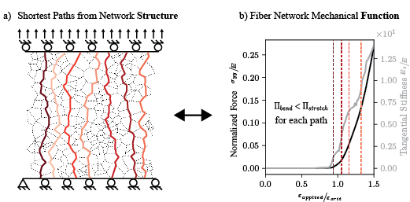

# Structure-function relationships in random fiber networks Code Repository

[](https://www.python.org/)

## Table of Contents

<p align="center">
  
</p>

* [Project Background and Summary](#summary)
* [Depedencies](#dependencies)
* [Directories](#directories)
* [References](#reference)

## Project Background and Summary <a name="summary"></a>

This code repository accompanies our paper "Towards understanding structure-function relationships in random fiber networks" publication (link to preprint coming soon!)

In brief, this work links the local geometric structure of random fiber networks to their emergent mechanical behavior though the network's distance-weighted shortest paths. We first investigated the structure-function relatipship of single fiber chains, before translating the information we obtaimed from single fiber chains to random fiber networks by interpreting the distance-weighted shortest paths as chains in parallel. This repository contains the code used to reproduce the all work. This includes the finite element model, spatial grpah anaylsis and analytical model. 

## Dependencies <a name="dependencies"></a>
Main dependencies of the project:

* Python 3.11.0
* Numpy 1.24.2
* Pandas 2.1.1
* fenics 2019.1.0 (i.e. fenics legacy)

For convenience, we provided an ``environment.yml`` file that we used on run our code. 

To create a new environment with the ``environment.yml`` file use:

```
conda env create -f environment.yml
```

[Additional instructions on how to use a conda environment file can be found here](https://docs.conda.io/projects/conda/en/latest/user-guide/tasks/manage-environments.html#creating-an-environment-from-an-environment-yml-file). 

## Directories <a name="directories"></a>
Brief description of all the directories in this repository. Additional details on the code will be described in the individual readmes in the directory.
|Directory| Description|
----------|----------
|fiber_networks/voronoi|scripts to mesh, run and plot FEA results for single fiber chains; code for analytical model|
|simple_chain|scripts to mesh, run and plot FEA results for fiber networks; code for spatial grpah conversion and analysis;code analytical model|
|utils|contains the bulk of the funcstions used in this work for for meshing, FEA, and graph analysis|

Note that all the mesh files, results txt files and figures are removed in this repository but can be regenerated with the provided code.

## References <a name="reference"></a>
Preprint coming soon!
  


  
